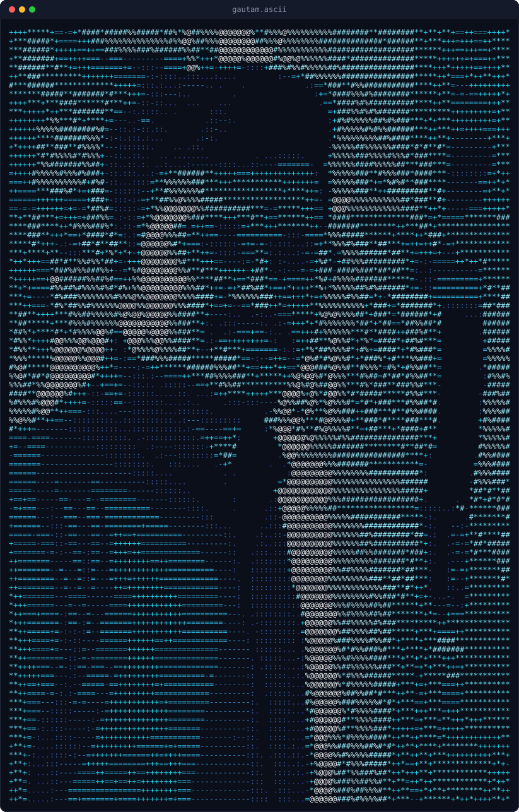

<div align="center">

# Gautam Gareja
### Senior Full Stack Developer & HubSpot Solutions Specialist

</div>

<table>
<tr>
<td valign="top" align="center" width="200">



</td>
<td valign="top">

```yaml
identity:
  name: Gautam Gareja
  role: Senior Full Stack
  focus: HubSpot Solutions
  status: shipping systems

stack:
  core: [Node, Nest, TS, PHP]
  web: [React, Next, Laravel]

platforms:
  crm: [HubSpot, Salesforce]
  ai: [LLM, Agents, Make]

session:
  base: Ahmedabad, India
  in: gautam-gareja
```

</td>
</tr>
</table>

## `$ whoami`

Senior Full Stack Developer and HubSpot Solutions Specialist, currently building at **TRooInbound**. My work spans full-stack web applications, HubSpot CRM architecture, API integrations, and AI-driven workflows, with a steady focus on systems that stay secure, maintainable, and easy to extend long after the first release.

Before specializing in HubSpot and AI-driven workflows, I spent five years as a PHP Developer at Tridhya Tech, shipping multi-role SaaS platforms, payment and analytics integrations, and internal tooling for clients across project management, energy, and healthcare.

---

## `$ cat core-systems.yml`

```yaml
backend:
  languages: [Node.js, NestJS, TypeScript, PHP]
  frameworks: [Laravel, Symfony, YII]
  interfaces: [REST APIs, Webhooks, OAuth, Serverless Functions]

frontend:
  stack: [React, Next.js, JavaScript, HTML5, CSS]
  legacy: [jQuery, Ajax, Bootstrap]

data_and_tools:
  database: [MySQL]
  tooling: [Git, PowerShell, Linux, JIRA, Trello, Basecamp]

architecture:
  patterns: [API Security, Rate Limiting, Circuit Breakers, Enterprise Architecture]
  observability: [Structured Logging - Winston, Pino]
  analytics: [Google Analytics, Google Tag Manager]
```

---

## `$ cat hubspot.yml`

HubSpot is where most of my deepest architecture work lives, custom CRM surfaces, not just API calls.

```yaml
hubspot:
  build: [Custom CRM Cards, UI Extensions, HubDB-backed apps]
  automate: [Workflow Automation, Suppression Lists, Approval Systems]
  integrate: [Salesforce, PandaDoc, Custom Object Mapping]
  scope: [CRM Architecture, Data Sync, Third-Party Webhooks]
```

---

## `$ cat ai-automation.yml`

Building agentic workflows and applying them to real problems, not chasing buzzwords.

```yaml
ai:
  agents: [AI Agent Builder - Make]
  workflows: [LLM Workflows, Agentic Automation]
  craft: [Prompt Engineering, Context Engineering]
  applied: [AI Mental Wellness Tracker - built in under 4 hours]
```

---

## `$ ls systems-shipped/`

**Project Management System (PMS)**
Multi-role portal streamlining task tracking, leave management, and team collaboration.
`Laravel · MySQL · Firebase · Bootstrap`

**Lumisa**
Operations platform for a Spanish electricity marketer; data analytics driving cost-effective energy plans.
`Symfony · React · Next.js · MySQL`

**Handprint SaaS**
Plugin-creation portal for e-commerce and non-e-commerce platforms with granular role and module access.
`Laravel · MySQL · Stripe · Google Analytics`

**Trifecta Teams**
Simplifies Microsoft Teams Direct Routing and telephony management.
`Laravel · PowerShell · MySQL · Stripe`

**Project Information System (PIS)**
Multi-role portal managing projects, clients, developers, and payments.
`Laravel · MySQL · Bootstrap · jQuery`

**VenueServe**
Event-creation portal with Stripe-powered ticketing and public box-office pages.
`Laravel · MySQL · Stripe · HTML5`

**Dental Solutions**
Direct dental-implant ordering platform, replacing regional distributors.
`YII · MySQL · PayPlus · Firebase`

---

## `$ cat achievements.yml`

### 95.19 / 100, Google for Developers PromptWars Hackathon

Built an AI Mental Wellness Tracker prototype in under 4 hours.

```yaml
certifications:
  - Integrating With HubSpot I: Foundations (HubSpot Academy)
  - HubSpot Data Integrations Certification (HubSpot Academy)
  - AI Agent Builder (Make)
  - Claude Code in Action (Anthropic)
```

---

## `$ cat principles.md`

```yaml
principles:
  - Understand the system before changing it
  - Reuse existing functionality instead of duplicating it
  - Build for maintainability, security, and backward compatibility
  - Validate and test before calling anything done
```

---

## `$ contact --info`

```yaml
contact:
  linkedin: https://in.linkedin.com/in/gautam-gareja
  location: Ahmedabad, Gujarat, India
```

---

<div align="center">

> Great software isn't just about writing code; it's about understanding the platform, following best practices, and building solutions that scale with confidence.

</div>

---

<div align="center">
<sub>

Active for <!--GH-UPTIME:START-->1y 6m (GitHub since 2025)<!--GH-UPTIME:END--> · Primarily writing <!--GH-LANGS:START-->pending (repo stats still indexing)<!--GH-LANGS:END-->

</sub>

<details>
<summary><sub>GitHub activity snapshot (auto-updated daily)</sub></summary>

<br>

This account is new (created 2025); most of the work referenced above lives in private and client repositories, so the numbers below are a small, honest slice of the whole picture, not the full story.

<pre>
<!--GH-STATS:START-->
Repos      : 1 (public, owned)
Stars      : 0
Commits    : pending first automated run
Followers  : 0
Lines      : pending first automated run
<!--GH-STATS:END-->
</pre>

</details>

</div>
